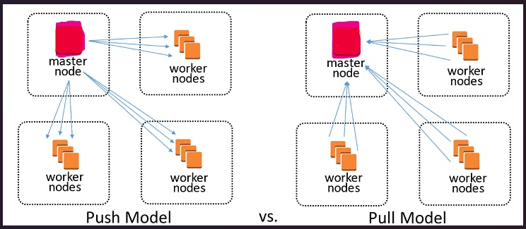
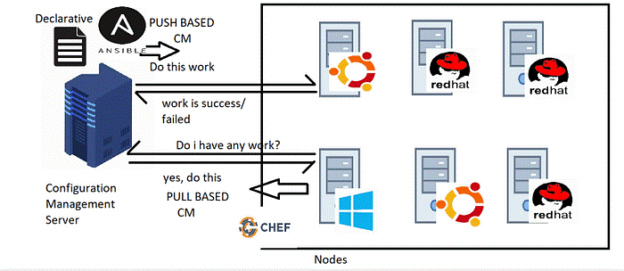

# Introduction to Ansible

## What is Ansible?

Ansible is an open-source IT automation engine that automates:
- Provisioning
- Configuration management
- Application deployment
- Orchestration

and many other IT processes. It is free to use, and the project benefits from the experience and intelligence of its thousands of contributors.

## How Ansible Works

Ansible is agentless in nature, which means you don't need to install any software on the managed nodes.

For automating Linux and Windows, Ansible connects to managed nodes and pushes out small programs—called Ansible modules—to them. These programs are written to be resource models of the desired state of the system. Ansible then executes these modules (over SSH by default) and removes them when finished. These modules are designed to be idempotent when possible, so that they only make changes to a system when necessary.

For automating network devices and other IT appliances where modules cannot be executed, Ansible runs on the control node. Since Ansible is agentless, it can still communicate with devices without requiring an application or service to be installed on the managed node.

## Ansible Architecture

Ansible operates on an agentless architecture, relying on a central control node to manage target machines (hosts) via SSH for Linux/Unix systems and WinRM for Windows systems. The core components include:
1. **Control Node**: Executes Ansible playbooks, which are YAML files defining automation tasks.
2. **Managed Nodes**: The target machines being configured and managed.
3. **Inventory**: Lists of managed nodes and groups, specifying their connection details.
4. **Modules**: Executable code units on managed nodes performing specific tasks.
5. **Playbooks**: YAML files containing organized sets of tasks.

This architecture simplifies deployment, reduces overhead, and ensures consistency across environments.

### Ansible Architecture Diagram

## Ansible Configuration Models:

Ansible offers flexibility with both pull and push models. We must evaluate our operational needs to determine which model or combination thereof best aligns with our requirements for efficient configuration management and deployment:
1. **Push Configuration Model**: Ansible primarily utilizes a push model where the control node (Ansible server) initiates and pushes configuration changes and tasks to managed nodes. This process involves the control node establishing SSH connections (or WinRE for Windows) to managed nodes and executing tasks defined in playbooks. The push model ensures immediate deployment and execution of tasks, making it ideal for environments requiring real-time updates and rapid deployment cycles.
2. **Pull Configuration Model (Ansible Pull)**: Alternatively, Ansible supports a pull model known as Ansible Pull. In this configuration, each managed node retrieves its configurations from a centralized source, typically a version control system or a configuration management server. Managed nodes use cron jobs or scheduled tasks to periodically pull configuration changes and apply them locally. This model is advantageous in environments where managed nodes have restricted inbound network access or when nodes need to self-manage configuration updates independently.

### Ansible Configuration Models Diagrams

